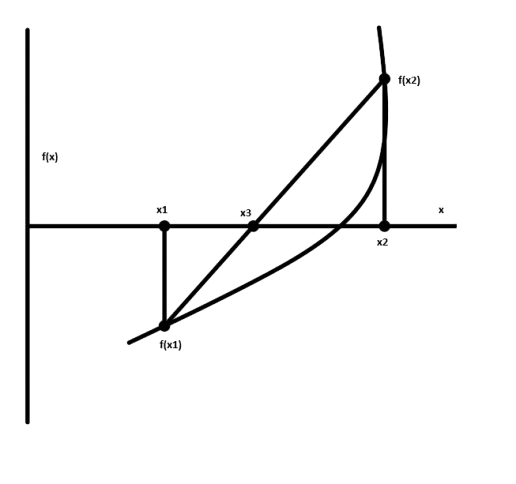

<h3>False Position</h3>

    False Position (also called the linear interpolation method) is another well known bracketing method. It is very similar to bisection with the exception that it uses a different strategy to come up with its new root estimate. Rather than bisecting the interval, it locates the root by joining f(x2) and f(x1) with a straight line (Fig 1). The intersection of this line with the x axis represents an improved estimate of the root. Thus, the shape of the function influences the new root estimate. Using similar triangles, the intersection of the straight line with the x axis can be estimated as,  
    x3 = x1 - f(x1) * ((x2 - x1) / (f(x2) - f(x1))); &nbsp;&nbsp;&nbsp;&nbsp;&nbsp;&nbsp; ...(eq. 1)
     

    This is the False Position formula. The value of x3 computed with (eq. 1), then replaces whichever of the two initial guesses, x2 or x1, yields the funtion value with the same sign as f(x3). In this way, the values of x2 and x1 always bracket the true root. The process is repeated until the root is estimated adequately.

 Fig 1 
